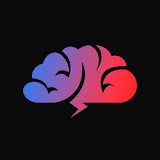

# BrainsCloud [YouTube](https://www.youtube.com/@BrainsCloud)

Хочешь научиться создавать сайты? Тогда тебе сюда!
Много качественного контента по веб-разработке тебе обеспечено!

Меня зовут Дмитрий Валак. Я занимаюсь разработкой сайтов уже много лет, специализируюсь больше на front-end разработке и верстке сайтов, но и программирование тоже изучаю. Здесь буду делиться с вами информацией на разные темы по веб-разработке - HTML, CSS, Javascript, JQuery, Vue, PHP, MySQL, React, Gulp и тд.

На сайте проекта [brainscloud.ru](https://brainscloud.ru) вы найдете много полезных закрытых материалов, а так же сможете поработать со мной лично, при наличии такого желания.

HTML, CSS справочник [htmlbase.ru](https://htmlbase.ru)

Ссылка на канал [YouTube](https://www.youtube.com/@BrainsCloud)

## activeBox
Верстка сайта с нуля для начинающих с подробными объяснениями используя HTML и CSS. Верстка сайта это процесс создания сайта из макета, который нарисовал дизайнер. Практика это самый важный элемент изучения верстки сайтов. Смотрите, делайте и получайте результат!

Ссылка на видео курс: [YouTube](https://www.youtube.com/watch?v=b8K_iowSriQ&list=PLoq3Accf02PVO4GvY4-UtIQkeD6tNmX_f)

Ссылка на макет: [Zip архив](data/activeBox.zip)

## inWeb
В этом видео начнем верстать сайт с нуля. Верстка сайта это процесс создания сайта из макета, который нарисовал дизайнер. Видео не только для начинающих, в нем будем испольсовать препроцессор SASS, сборщик Gulp, инструмент для создания иконки сайта favicon generator, и также подключим популярный фреймворк Bootstrap!

Ссылка на макет для создания иконки сайта: [brainscloud.ru](https://brainscloud.ru/storage/app/media/PROFHTML/favicon.png)

Ссылка на инструмент для преобразования изображения в фавиконку: [realfavicongenerator.net](https://realfavicongenerator.net/)

Ссылка на пустой шаблон (иерархия папок и gulpfile) проекта: [brainscloud.ru](https://brainscloud.ru/storage/app/media/PROFHTML/gulp-skeleton.zip)

Ссылка на пустой шаблон (иерархия папок и gulpfile) проекта: [Zip архив](data/gulp-skeleton.zip)

## moGo
В этом видео начнем верстать сайт с нуля. Верстка сайта это процесс создания сайта из макета, который нарисовал дизайнер. Видео для начинающих, в нем не будет препроцессоров, сборщиков и каких-либо инструментов, только HTML и CSS!

Ссылка на видео курс: [YouTube](https://www.youtube.com/watch?v=ltMSrSis9ww&list=PLoq3Accf02PVdUqjqPdWMG4HbEZXlhICW)

Ссылка на макет: [freebiesbug.com](https://freebiesbug.com/psd-freebies/mogo-free-one-page-psd-template/)
