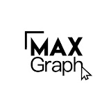

# maxgraph
**MaxGraph - cайты как страсть**

 Привет! Это MaxGraph!

Меня зовут Максим. Верстальщик, занимаюсь веб-разработкой 7 лет

На этом канале я делюсь всеми своими знаниями в html-верстке сайтов, раскрываю возможности заработка, делюсь реальными кейсами из своей собственной работы.

За последние 7 лет я успешно выполнил большое количество заказов из разных уголков мира, работаю преподавателем в онлайн-университете, написал целый обучающий курс по верстке сайтов с нуля.

- Расскажу как начать верстать сайты с полного нуля.
- Поделюсь реальными кейсами из своей работы, над которыми я свое время потел.
- Расскажу, куда двигаться дальше, чтобы быть всегда востребованным.

Увидимся на видео!

## mitravel
Привет! Ну что, поверстаем?

В этом видео я начинаю верстать адаптивный сайт с нуля до выгрузки на хостинг. Мы вместе поэтапно пройдем все стадии верстки - разметим макет, напишем сетку, применим стили, сделаем адаптивную верстку, напишем js-код, а после загрузим все это на хостинг!

Данное видео предназначено для новичков, которые уже базово знакомы с тегами и стилями, но им не хватает понимания того, как же правильно верстать страницы. В этом я как раз и помогу. Используем только "чистые" языки - html, css, js (js-плагины), чтобы можно было просто сесть и верстать, не углубляясь в сборщики, препроцессоры и т.д. Ну и конечно, будем делать все pixel perfect.

И, как сейчас модно и удобно - используем для верстки крутой и удобный редактор - Figma.

Ссылка на видео курс: [YouTube](https://www.youtube.com/watch?v=b8K_iowSriQ&list=PLoq3Accf02PVO4GvY4-UtIQkeD6tNmX_f)

Ссылка на макет: [Pdf файл](data/layoutMitravel.pdf)

Ссылка на макет: [Figma](https://www.figma.com/design/6doFNNXepkzolMs4usZlL1/MaxGraph-Youtube-marathon-1.0?node-id=0-1&node-type=canvas)

## inWeb
В этом видео начнем верстать сайт с нуля. Верстка сайта это процесс создания сайта из макета, который нарисовал дизайнер. Видео не только для начинающих, в нем будем испольсовать препроцессор SASS, сборщик Gulp, инструмент для создания иконки сайта favicon generator, и также подключим популярный фреймворк Bootstrap!

Ссылка на макет для создания иконки сайта: [brainscloud.ru](https://brainscloud.ru/storage/app/media/PROFHTML/favicon.png)

Ссылка на инструмент для преобразования изображения в фавиконку: [realfavicongenerator.net](https://realfavicongenerator.net/)

Ссылка на пустой шаблон (иерархия папок и gulpfile) проекта: [brainscloud.ru](https://brainscloud.ru/storage/app/media/PROFHTML/gulp-skeleton.zip)

Ссылка на пустой шаблон (иерархия папок и gulpfile) проекта: [Zip архив](data/gulp-skeleton.zip)
