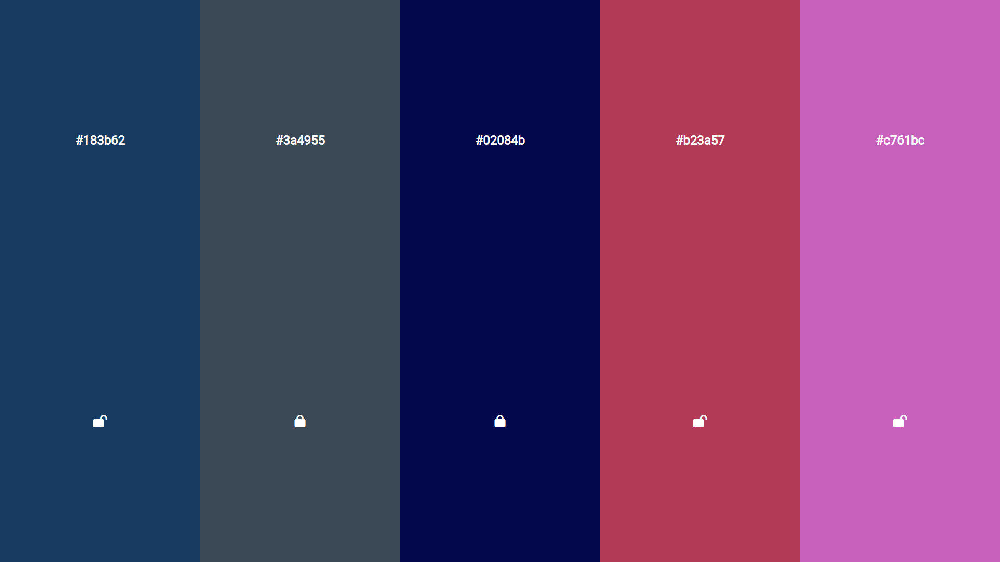

# [VladilenMinin](https://www.youtube.com/@VladilenMinin)
Frontend разработчик с 2012 года. Сейчас предприниматель и основатель: [result-university.com](https://result-university.com/)

## colors
Создай КРУТОЙ проект в портфолио на JavaScript. Простой сервис по выбору цветов с возможностью копирования текста в буфер обмена.

Ссылка на видео курс: [Youtube](https://www.youtube.com/watch?v=OaNICHKM5KM&list=PLgZLkhmkUbsW-SlAbSFAiqSnmpbmDNpD7&index=4)

